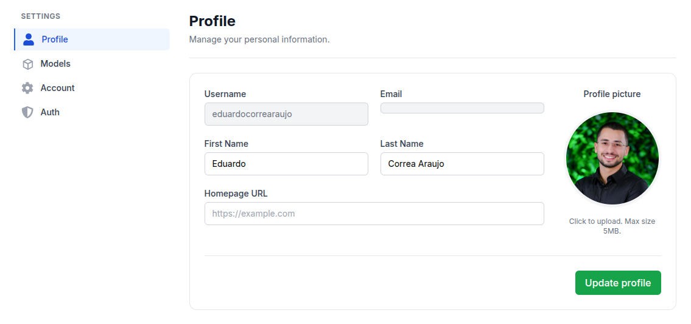
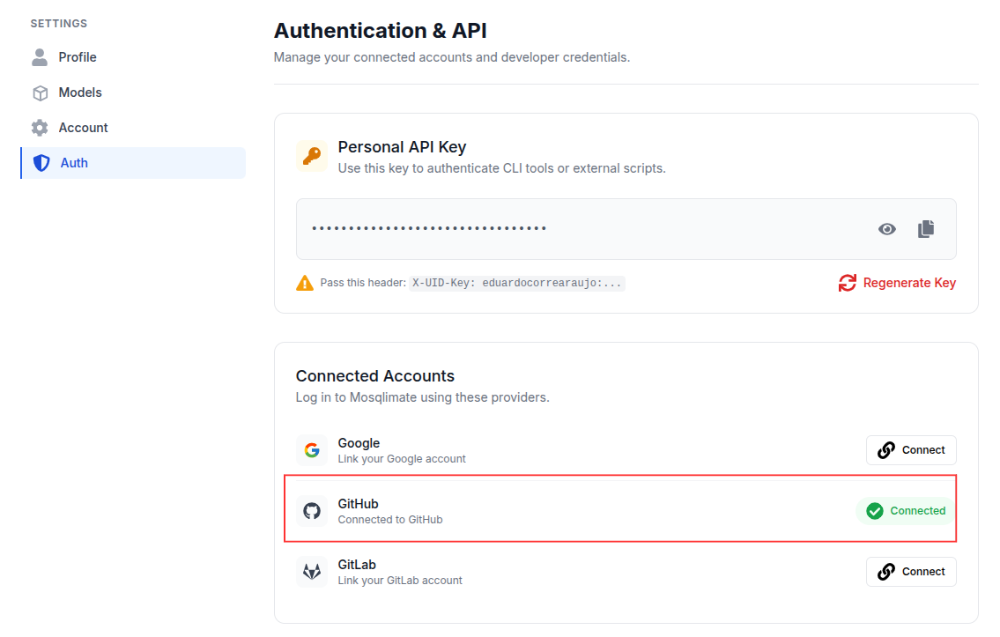

<p align="center">
  
</p>


This tutorial provides step-by-step guidance on how to participate in the challenge. We assume here that you are already familiar with GitHub and how to use it. If you're not, please take a look at [this tutorial](https://docs.github.com/en/get-started/start-your-journey/hello-world).

## Registering in the Mosqlimate Platform
The Mosqlimate platform is where all models and predictions are stored, alongside with the data used for the modeling. It provides a [REST API](https://api.mosqlimate.org/api/docs) that is completely language agnostic, for accessing the data as well as registering models. It is fully documented but requires some familiarity with APIs to use. In addition, we make available a a simplified client library named [Mosqlient library](https://github.com/Mosqlimate-project/mosqlimate-client), available for Python and R (using `reticulate`), that simplifies the interaction with the platform.

The Mosqlimate Platform is responsible for all interactions with the the participants of the challenge. Therefore, to participate in this IMDC, the first step we require from you, as team leader, is to register your team to the Mosqlimate platform (There is not cost associate with this membership). In order to do this, simply go to [mosqlimate.org](https://mosqlimate.org/), click on the "Login" in the top right corner of the page, and follow the instructions. Please use your GitHub or GitLab account to create your platform account. Otherwise, you will not be able to register your model, as it must be linked to a repository in your GitHub or GitLab account. Once you create your Mosqlimate profile, you are set to follow the steps below.



After creating your account, go to the “Auth” section to verify whether it is linked to GitHub or GitLab. This step is required in order to register your model.



This section also displays your API key. You need it to download data using the API or submit forecasts to the platform.

You can access the challenge data via the API. However, note that the IMDC forecasts are based on probable cases; therefore, when using the API, you should use the `casprov` column from the Infodengue endpoint. **To simplify access to nationwide data and provide additional datasets, the data is also available on an FTP server. More details can be found [here](https://sprint.mosqlimate.org/data/).**


Now let's move on to setting up the GitHub repository for your submission.

## Using the GitHub template for the IMDC submission
This github repository should be used as a template for developing your submission for the 2026 IMDC. To get the details about the challenge, please read carefully [IMDC rules](https://sprint.mosqlimate.org/instructions/). 

If you have a GitHub account, you can create a new public repository clicking the (+) button on the top right of this page. In the following page, you can create the repo under your user as shown below, make sure to use our template as indicated by the red arrow in the figure below.

 <span style="color:red"><strong>You should name your repository following this pattern: 3rd_imdc_{institution}_{team_name}
* All letters must be lowercase.
* In {institution}, include only the acronym of the team leader’s institution.
* In {team_name}, you may choose any name you like, but it must contain only lowercase letters </strong></span>!


> <strong> Important: </strong>Don't forget to set it as a public repository. In addition, please ensure your model repository includes a clear and complete `README.md` file containing the following information:
>
> <strong> 1. Team and Contributors</strong> 
>* Name of your team.
>* Names of all contributors and their affiliations >(universities/institutions, if applicable).
>
>
><strong> 2. Repository Structure </strong>
>
>A brief description of the contents and purpose of >each folder and file in the repository.
>
><strong> 3. Libraries and Dependencies </strong>
>
>A list of all libraries and packages used to process the data and train your model.
>
><strong> 4. Data and Variables </strong>
>
>* Which datasets and variables were used?
>* How was the data pre-processed?
>* How were the variables selected? Please point to the relevant part of the code.
>
><strong>5. Model Training </strong> 
>
>* Description of how the model was trained. If applicable, describe any hyperparameter optimization techniques used.
>
>* Please specify where the code for training and generating forecasts is located, and provide instructions on how to run it.
>
><strong> 5. Data Usage Restriction </strong>
>
>Describe how you handled the requirement of using only data up to EW 25 of the current year to generate predictions from EW 41 of the same year to EW 40 of the next year.
>
><strong> 6. Predictive Uncertainty </strong> 
How are your prediction intervals computed? 
>
><strong> 7. References </strong>
>
>If your model is based on a published or preprint (e.g., arXiv) paper, include the citation, DOI, and link.
>
><strong> An illustrative example from the previous edition is available [here](https://mosqlimate.org/davibarreira/jbd-mosqlimate-sprint).</strong>


## Step-by-step tutorial on how to register your model

Now that your repository is set up, and after providing the required information about your model in the repository README, make sure that all code related to your model is committed to it. <span style="color:red"><strong>If you want to register more than one model, be sure to repeat the step above for each one, so that they are in separate repositories.</strong></span>

The model is registered through the platform’s interface. The first step, assuming you are already logged into the platform, is to click on the `Models` section in the navigation bar. This section is indicated by the arrow in the figure below:


Next, you will be directed to a page displaying all models registered on the platform. To register a new model, simply click the green `+ Models` button indicated by the arrow in the figure below:


After clicking it, a new tab will open showing a list of your GitHub/GitLab repositories.

If you have not connected your GitHub/GitLab account correctly, a message will appear indicating that you need to complete the connection. In this case, simply follow the instructions provided.


If your GitHub/GitLab account is already connected, the screen below will appear with a list of your repositories. Locate the repository containing your model’s code. When you hover over it, a blue arrow pointing to the right will appear, indicating that it can be selected. Click on it to proceed to the next step.


In this step, fill the temporal resolution (field `time resolution`) and select the category (field `model_category`) that best describes your model’s methodology. Models for the challenge **must have a weekly temporal resolution**. Finally, indicate that your model will participate in IMDC 2026 and click continue.


The next page allows you to review the information provided. If everything is correct, simply click `Confirm`.

**Done! Your model has been successfully submitted. ;)**

After submission, the README from your repository will appear in the README section of model page, as shown in the figure below:


The predictions section will initially be empty, as shown below. In the next step, you will learn how to submit forecasts for your model using Python or R.


## Step-by-step tutorial on how to prepare your submission

This guide walks you through how to format and submit your forecasting models to the API. You can send your data either as a standard JSON payload or by using the official Python package (**recommended**).

Below, we provide examples using the `mosqlient` package. For details on submitting data via the standard JSON payload, see the documentation [here](https://api.mosqlimate.org/docs/registry/POST/predictions/). 

### Using `mosqlient package`: 

**Checking for minimal configuration requirements on your operating system**

Since you are going to use a python library to submit your work, before installing it you need to make sure that you OS has a working Python installation.

On a debian-based Linux distribution(Ubuntu, Mint, etc.), just run the following command:

```bash
sudo apt install python3-dev jupyter python3-venv python3-pip
```

On Mac OS (using homebrew):
```
# Install Python and Jupyter
brew install python
pip3 install jupyter

# Install virtual environment and development headers
pip3 install virtualenv
```

**Installing the Mosqlient library**

To install the library for Python, from the OS terminal type: 

```bash
$ pip install -U mosqlient
```

Ensure your Python version is 3.10 or higher to install the latest version of the package (2.1).

for R:

```R
> library(reticulate)
> py_install("mosqlient")
```

You need to already have the `reticulate` package installed.

**Starting your work!**
We prepared a couple of demo Jupyter notebooks to get you started.  In you local computer make sure you have Python 3.10 or higher and Jupyter installed.

If you are an R user, make sure you have the R kernel installed in your Jupyter notebook. you can install it by running the following command **in an R terminal**:

```R
> install.packages("IRkernel")
> IRkernel::installspec()
```

After this you can just open the notebooks indicated below and follow the instructions in them.

Follow the [R demo rmd](/Demo%20Notebooks/R%20demo.Rmd) or [Python demo notebook](/Demo%20Notebooks/Python%20demo.ipynb) to learn of the essential steps you must follow to complete a submission of your work. For more details check the [mosqlient documentation](https://mosqlimate-client.readthedocs.io/en/latest/tutorials/API/registry/). If you run into dificulties, please reach out fo help at our [discord server](https://discord.gg/yqtgW4TC).